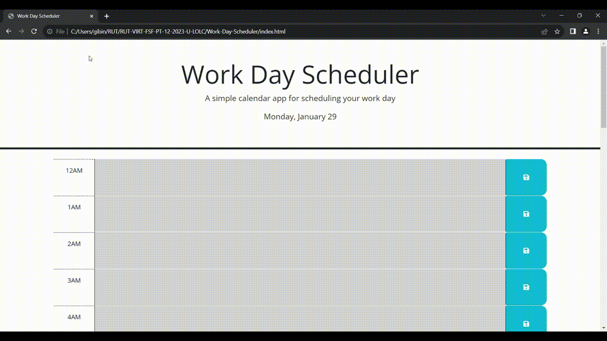

# Work-Day-Scheduler

This Web Application is a day scheduler to manage time effectievely.

When the planner is opened, Then the current day is displayed at the top of the calendar
Scroll down to see the time blocks for a day of 12am to 11pm
When we view the time blocks for that day, each time block is color-coded to indicate whether it is in the past, present, or future
When we click into a time block, Then we can enter an event
When we click the save button for that time block, then the text for that event is saved in local storage
When the page is refreshed, the saved events persist

JavaScript and CSS file is properly commented.

* The URL of the deployed application - https://gibinmgeorge.github.io/Password_Generator/

* The URL of the GitHub repository - https://github.com/GibinMGeorge/Work-Day-Scheduler

screenshots - 

